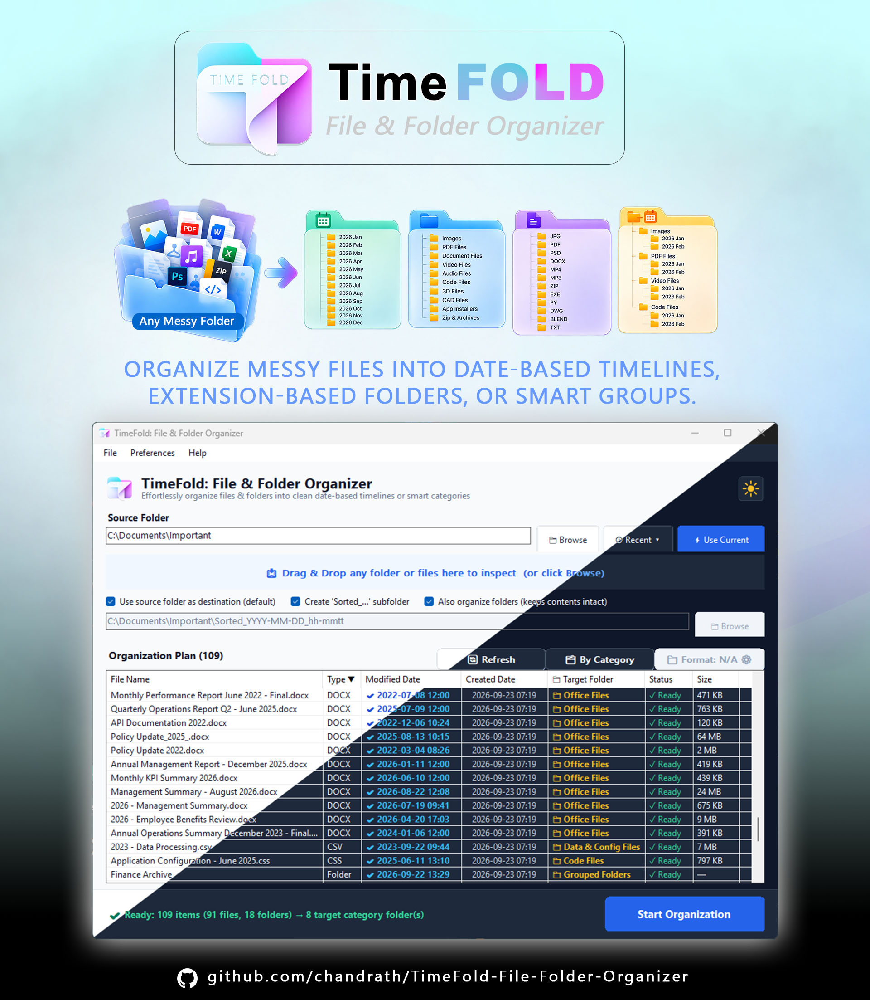

<p align="center">
  
</p>

<h1 align="center">TimeFold: File & Folder Organizer</h1>

<p align="center">
  <strong>Fast, non-destructive file and folder organizer for Windows that turns messy directories into clean date-based timelines, file-type categories, or structured extension-based folders.</strong>
</p>

<p align="center">
  <a href="https://www.microsoft.com/windows"></a>
  <a href="https://dotnet.microsoft.com/download/dotnet/10.0"></a>
  <a href="https://github.com/chandrath/TimeFold-File-Folder-Organizer/releases/latest"></a>
  <a href="LICENSE"></a>
  <a href="https://github.com/chandrath/TimeFold-File-Folder-Organizer/releases/latest"></a>
</p>

<p align="center">
  
</p>

---

## What TimeFold Does

TimeFold is a Windows file and folder organizer for people who have too many files in places like **Downloads**, **Screenshots**, **Photos**, or the **Desktop**.

Instead of manually creating folders and moving files one by one, TimeFold scans a selected folder, shows you the planned destinations, and then organizes the files and supported folders into the structure you choose.

Imagine your **Downloads** folder has **10,000+ random files**:

```text
Downloads/
├── photo123.jpg
├── invoice.pdf
├── vacation.mp4
├── project.zip
├── screenshot.png
├── report.docx
├── presentation.pptx
├── song.mp3
├── model.blend
├── drawing.dwg
├── vlc-setup.exe
├── script.py
└── ... 10,000+ other files
```

With TimeFold, that same folder can be organized into a predictable structure instead of one large mixed list.

### Organize by file category

TimeFold can group supported files into categories such as **Images, PDF Files, Document Files, Office Files, Video Files, Audio Files, 3D Files, CAD Files, Code Files, App Installers, Zip & Archives, and Git Repos**.

```text
Downloads/
├── Images/
│   ├── photo123.jpg
│   └── screenshot.png
│
├── PDF Files/
│   └── invoice.pdf
│
├── Document Files/
│   └── report.docx
│
├── Office Files/
│   └── presentation.pptx
│
├── Video Files/
│   └── vacation.mp4
│
├── Audio Files/
│   └── song.mp3
│
├── 3D Files/
│   └── model.blend
│
├── CAD Files/
│   └── drawing.dwg
│
├── Code Files/
│   └── script.py
│
├── App Installers/
│   └── vlc-setup.exe
│
├── Zip & Archives/
│   └── project.zip
│
└── Git Repos/
    └── my-web-app/
```

### Organize by date

TimeFold can also organize files and folders into date-based folders. You can choose the date format in Preferences:

```text
Month    → 2026-08
Day      → 2026-08-15
Quarter  → 2026-Q3
Year     → 2026
```

For example, a month-based organization can look like this:

```text
Downloads/
├── 2025-01/
│   ├── invoice_amazon.pdf
│   ├── IMG_2847.jpg
│   └── project-report.docx
│
├── 2025-02/
│   └── vacation.mp4
│
├── 2025-03/
│   └── presentation.pptx
│
├── 2026-01/
│   ├── invoice_10482.pdf
│   ├── IMG_4921.jpg
│   └── project.zip
│
└── 2026-03/
    ├── resume.docx
    └── screenshot.png
```

### Combine date and category

When you want both chronological organization and file-type grouping, TimeFold supports two-level hybrid structures.

**Category / Date**

```text
Downloads/
├── Images/
│   ├── 2026-08/
│   └── 2026-09/
│
├── PDF Files/
│   ├── 2026-08/
│   └── 2026-09/
│
├── Video Files/
│   ├── 2026-08/
│   └── 2026-09/
│
└── Zip & Archives/
    ├── 2026-08/
    └── 2026-09/
```

**Date / Category**

```text
Downloads/
├── 2026-08/
│   ├── Images/
│   ├── PDF Files/
│   ├── Video Files/
│   └── Zip & Archives/
│
└── 2026-09/
    ├── Images/
    ├── PDF Files/
    ├── Video Files/
    └── Zip & Archives/
```

### Organize by file extension

For a more precise structure, TimeFold can organize files by their actual file extension.

```text
Downloads/
├── ZIP/
│   ├── project.zip
│   └── backup.zip
│
├── PSD/
│   ├── website-design.psd
│   └── logo.psd
│
├── DOCX/
│   ├── report.docx
│   └── resume.docx
│
├── PDF/
│   ├── invoice.pdf
│   └── manual.pdf
│
├── JPG/
│   ├── photo123.jpg
│   └── IMG_2847.jpg
│
├── MP4/
│   └── vacation.mp4
│
└── PY/
    └── script.py
```

### One tool, multiple ways to organize

TimeFold gives you several organization strategies, depending on how you want to work:

| Organization method | What it does |
| --- | --- |
| **Category** | Groups supported files into categories such as Images, PDF Files, Document Files, Office Files, Video Files, Audio Files, 3D Files, CAD Files, Code Files, App Installers, Zip & Archives, and Git Repos |
| **Date** | Groups files and folders by Month, Day, Quarter, or Year |
| **Category / Date** | Uses category as the first folder level and date as the second |
| **Date / Category** | Uses date as the first folder level and category as the second |
| **File Extension** | Groups files by their actual extension such as PDF, JPG, DOCX, ZIP, PSD, or PY |

TimeFold is not just a visual sorter. It **actually relocates files and supported folders** into the destination structure generated by your selected organization method.

---

## Why TimeFold Is Useful

A folder with thousands of mixed files can make everyday file management harder:

- **Digital clutter:** Downloads, receipts, screenshots, media, archives, and project files accumulate in one place.
- **Manual sorting takes time:** Creating folders and moving files individually is repetitive and error-prone.
- **Harder to find files:** When unrelated file types share the same directory, locating the right item becomes slower.
- **Large folders need structure:** A predictable hierarchy makes large collections easier to browse and maintain.

TimeFold is designed to reduce that manual work while keeping the organization process visible and reviewable.

---

## How TimeFold Works

TimeFold uses a **preview-first workflow** so you can see what it plans to do before organization begins.

1. **Select Source:** Choose or drag and drop the folder you want to organize.
2. **Review Preview:** TimeFold scans the directory and shows the planned destinations in the live preview grid.
3. **Configure Options:** Choose your preferred date format, custom prefixes, or 24-hour timestamps in Preferences.
4. **Start Organizing:** Start the organization and watch progress in real time as items are moved into their destinations.
5. **Review the Result:** Open the output folder and use the generated CSV audit log to review the organization run.

---

## ✨ Key Features

- **⚡ Smart Date Sorting:** Organize files and folders by **Month**, **Day**, **Quarter**, or **Year**.
- **🗂️ Smart Categories:** Organize supported files into **Images, PDF Files, Document Files, Office Files, Video Files, Audio Files, 3D Files, CAD Files, Code Files, App Installers, Zip & Archives, and Git Repos**.
- **🧩 Hybrid Organization:** Combine date and category using **Category / Date** or **Date / Category** nesting.
- **🔤 File Extension Mode:** Organize files by their raw file extension for a more precise structure.
- **🛡️ Non-Destructive Organization:** TimeFold does not delete, alter, or compress your original files. It relocates items cleanly into the organized structure you choose, and never extracts or touches files inside existing subfolders.
- **↩️ Undo Operation (Beta):** Safely roll back your last organization run with robust collision protection, restoring items to their original locations and cleaning up session audit logs *(currently in beta while undergoing further real-world testing)*.
- **🔍 Full Interactive Preview:** Review files and their exact destinations in the live preview before moving anything.
- **📝 Automatic CSV Audit Logs:** Every organization run generates a timestamped audit trail so you can review where items went.
- **📦 Safe Git Repository Detection:** Automatically identifies Git repositories (containing `.git` or `.github`, including single-wrapper root folders) and keeps them 100% intact. Routes them to a dedicated `Git Repos` folder in Category modes, or places them on the chronological timeline in Date mode.
- **🚀 Large-Folder Support:** Designed to scan and paginate through large collections, including **10,000 to 100,000+ files**.
- **⚠️ Smart Timestamp Detection:** Detects and alerts you when files share identical timestamps, which can happen with extracted archives or downloaded files.
- **📁 Top-Level Folder Support:** Optionally organize loose subfolders alongside files with a single toggle.
- **🎨 Modern UI with Dark Mode:** Clean desktop interface with Light and Dark themes plus Windows 11 accent integration.
- **🖱️ Drag & Drop:** Drag and drop a folder into TimeFold to start the organization workflow.

---

## 🎬 Video Walkthrough

See TimeFold in action organizing directories, managing smart categories, routing Git repositories, and rolling back operations:

<p align="center">
  <a href="https://youtu.be/3CNbwjIt8SA" target="_blank">
    
  </a>
  <br />
  <em>▶️ Click above to watch the full walkthrough on YouTube: <a href="https://youtu.be/3CNbwjIt8SA"><strong>https://youtu.be/3CNbwjIt8SA</strong></a></em>
</p>

---

## 🚀 Getting Started

### Option 1: Download (Recommended)

1. Go to the [Releases](https://github.com/chandrath/TimeFold-File-Folder-Organizer/releases/latest) page.
2. Choose the download that fits your needs:

   - **⭐ ReadyToRun (`TimeFold-win-x64-ReadyToRun.zip`):** Recommended for everyone. Extract it and double-click `TimeFold.exe`. It is completely standalone with zero prerequisites.
   - **💻 Lightweight (`TimeFold-win-x64-RequiresDotNet10.zip`):** Ultra-compact 1.5 MB download for developers who already have the .NET 10 Desktop Runtime installed.

### Option 2: Build from Source

#### Prerequisites

- [Windows 10 / 11](https://www.microsoft.com/windows) (64-bit)
- [.NET 10 SDK](https://dotnet.microsoft.com/download/dotnet/10.0)

#### Clone & Run

```bash
# Clone the repository
git clone https://github.com/chandrath/TimeFold-File-Folder-Organizer.git
cd TimeFold-File-Folder-Organizer/src

# Run in Development Mode
dotnet run
```

#### Build Standalone Single-File Executable

To produce a standalone `.exe` that bundles all runtimes:

```bash
dotnet publish TimeFold.csproj -c Release -r win-x64 --self-contained -p:PublishSingleFile=true -p:EnableCompressionInSingleFile=true -p:DebugType=none -o ../publish
```

The compiled single-file `TimeFold.exe` will be generated inside the `publish/` directory.

---

## 🗺️ Roadmap

- [ ] **Native Windows on ARM (ARM64):** Alongside our current x64 (Intel/AMD) release, provide a dedicated native ARM64 build for Snapdragon X and Surface devices with maximum battery efficiency and zero emulation overhead.
- [ ] **macOS Desktop App:** Native graphical application for macOS (Apple Silicon M-series & Intel).
- [ ] **Linux Desktop App:** Native desktop release for popular Linux distributions (Ubuntu, Fedora, Arch).
- [ ] **Custom Category Builder:** Create your own custom category rules and custom extension groupings directly from the UI.
- [ ] **Localization:** Multilingual interface support for international users.

---

## 🛠️ Tech Stack

- **Runtime & Framework:** .NET 10 (Windows Desktop SDK)
- **Language:** C# 13
- **UI Framework:** Windows Forms (High-DPI aware, custom theme engine)
- **Dependencies:** Zero external NuGet packages (pure .NET standard libraries for maximum speed, security, and portability)

---

## 🤝 Contributing & Issues

Contributions, feedback, and suggestions make TimeFold better for everyone!

- **⭐ Star the Project:** If TimeFold helps keep your workspace clean, please give it a star on GitHub—it helps more users discover the tool!
- **🐛 Found an Issue or Bug?** Please [open an issue](https://github.com/chandrath/TimeFold-File-Folder-Organizer/issues) with details, reproduction steps, and any relevant logs.
- **🚀 Pull Requests Welcome:** Have a bug fix, performance optimization, or feature enhancement? Fork the repository, create a branch, and submit a PR!

---

## 📄 License

This project is open source and licensed under the [GNU General Public License v3.0 (GPLv3)](LICENSE).
