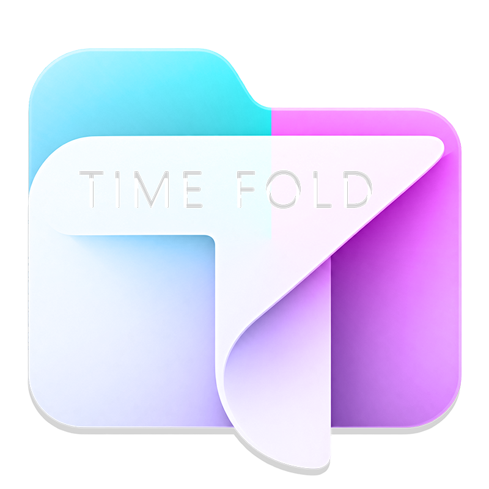
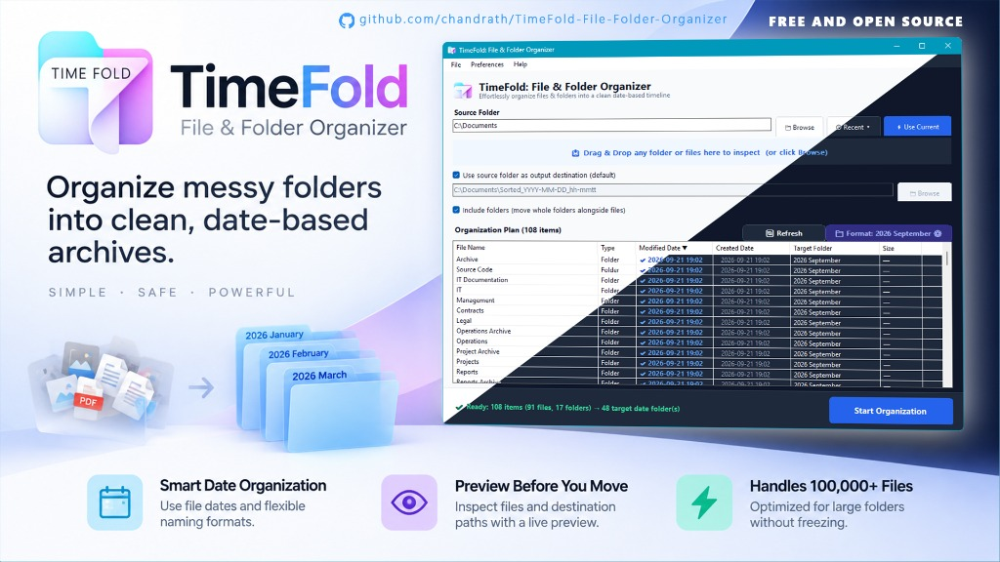

<p align="center">
  
</p>

<h1 align="center">TimeFold</h1>

<p align="center">
  A Windows file and folder organizer that lets you see where everything will go before anything moves.
</p>

<p align="center">
  <a href="https://github.com/chandrath/TimeFold-File-Folder-Organizer/releases/latest">
    
  </a>
  <a href="LICENSE">
    
  </a>
  
</p>

<p align="center">
  <a href="https://github.com/chandrath/TimeFold-File-Folder-Organizer/releases/latest">Download for Windows</a>
  ·
  <a href="https://youtu.be/3CNbwjIt8SA">Watch the walkthrough</a>
</p>

<p align="center">
  
</p>

## Why I built it

I originally made TimeFold because my own folders had become a mess. It worked well enough that I decided to clean it up, open-source it, and see whether it could be useful to anyone else.

## See where everything will go first

Pick a folder and TimeFold builds the organization plan before it moves anything.

You can review the planned destinations, skip items you want to leave alone, and then start the operation when the result looks right.

```text
Pick a folder
    ↓
See the planned result
    ↓
Review or skip items
    ↓
Start organizing
    ↓
Review the CSV log
```

## Key features

### Live preview

See the exact destination of each item before anything moves. The preview highlights the chosen date in **bold with a checkmark (✓)**, and automatically reveals a **Date Taken** column whenever media files contain EXIF camera metadata.

### Organize the way you want

Choose a structure based on **date**, **file extension**, **category**, or a combination of **date + category**.

### Undo and keep a record

Undo your last organization run, and get a timestamped CSV log showing what was moved and where it went.

### Keep control of what gets touched

Skip individual items, exclude folders, and keep recognized Git repositories together.

## Pick a structure

### By date

Turn a mixed folder into a simple timeline.

```text
Downloads/
├── 2026 August/
│   ├── invoice.pdf
│   ├── photo.jpg
│   └── report.docx
└── 2026 September/
    ├── project.zip
    └── screenshot.png
```

You can organize by **month, day, quarter, or year**.

### By category

Group files into folders such as **Images, Documents, Videos, Audio, Archives, Code, CAD, 3D, App Installers, and Git Repos**.

```text
Downloads/
├── Images/
├── Documents/
├── Videos/
├── Code/
├── Archives/
└── Git Repos/
```

### By file extension

Prefer a simple structure based on the extension?

```text
Downloads/
├── PDF/
├── JPG/
├── DOCX/
├── ZIP/
└── PY/
```

### Date + category

Use both when you want more structure.

```text
Downloads/
├── Images/
│   ├── 2026-08/
│   └── 2026-09/
└── Documents/
    ├── 2026-08/
    └── 2026-09/
```

Choose **Category / Date** or **Date / Category**.

## Watch it in action

The walkthrough shows the main flow from choosing a folder to reviewing the result.

<p align="center">
  <a href="https://youtu.be/3CNbwjIt8SA">
    
  </a>
</p>

<p align="center">
  <a href="https://youtu.be/3CNbwjIt8SA"><strong>Watch the walkthrough on YouTube</strong></a>
</p>

## Download and run

TimeFold is for **Windows 10 and 11, 64-bit**.

1. Open the [latest release](https://github.com/chandrath/TimeFold-File-Folder-Organizer/releases/latest).
2. Download the Windows x64 self-contained build.
3. Extract the ZIP.
4. Run `TimeFold.exe`.

No separate .NET runtime installation is needed for the self-contained build.

## Roadmap

- [ ] **Cross-platform support** (macOS, Linux, and Windows ARM64)

## A few things to know

TimeFold **moves** files and folders into a new structure. It does not edit the contents of those files.

Because moving a file changes its path, review the preview before starting and keep normal backups for anything important.

<details>
<summary><strong>How dates are chosen</strong></summary>

TimeFold uses the date selected in Preferences to organize your files. By default, files use Date Modified and folders use Date Created, but you can easily change these settings in Preferences.

For media files, eg. photos and videos, TimeFold extracts the original capture date from media metadata (EXIF). When metadata is detected, a dedicated **Date Taken** column appears in the preview table, and that date is automatically chosen.

In the preview, the date currently selected for each item is always highlighted in **bold with a checkmark (✓)**, so you know exactly which date is driving the organization at a single glance.

Date source and media-date options can be customized in **Settings > Preferences**.

</details>

<details>
<summary><strong>Folders you want to leave alone</strong></summary>

You can exclude folder names from Preferences.

For advanced use, a folder can also be protected with a file named `.timefold-ignore`. TimeFold treats that folder as off-limits and leaves its contents alone.

</details>

<details>
<summary><strong>Smart grouped files</strong></summary>

TimeFold detects Git repositories and keeps their contents together instead of reorganizing the files inside them.

It also recognizes some files that belong together, including matching movie and subtitle files and saved HTML pages with their companion asset folders.

</details>

<details>
<summary><strong>Other options</strong></summary>

Preferences include date formats, custom prefixes, 24-hour timestamps, media-date options, folder exclusions, and an option to include top-level folders in the organization.

Large folders use a paginated preview, and TimeFold can warn when multiple files share the same timestamp.

You can also drag and drop a folder into the app to start a scan.

</details>

## Build from source

For developers who want to run or build TimeFold themselves:

```bash
git clone https://github.com/chandrath/TimeFold-File-Folder-Organizer.git
cd TimeFold-File-Folder-Organizer/src
dotnet run
```

To create a Windows x64 standalone build:

```bash
dotnet publish TimeFold.csproj -c Release -r win-x64 --self-contained -p:PublishSingleFile=true -p:EnableCompressionInSingleFile=true -p:DebugType=none -o ../publish
```

The published `TimeFold.exe` will be in the `publish/` directory.

## Contributing

Found a bug, have an idea, or want to improve TimeFold? Open an [issue](https://github.com/chandrath/TimeFold-File-Folder-Organizer/issues) or submit a pull request.

## License

TimeFold is open source under the [GNU GPLv3](LICENSE).
